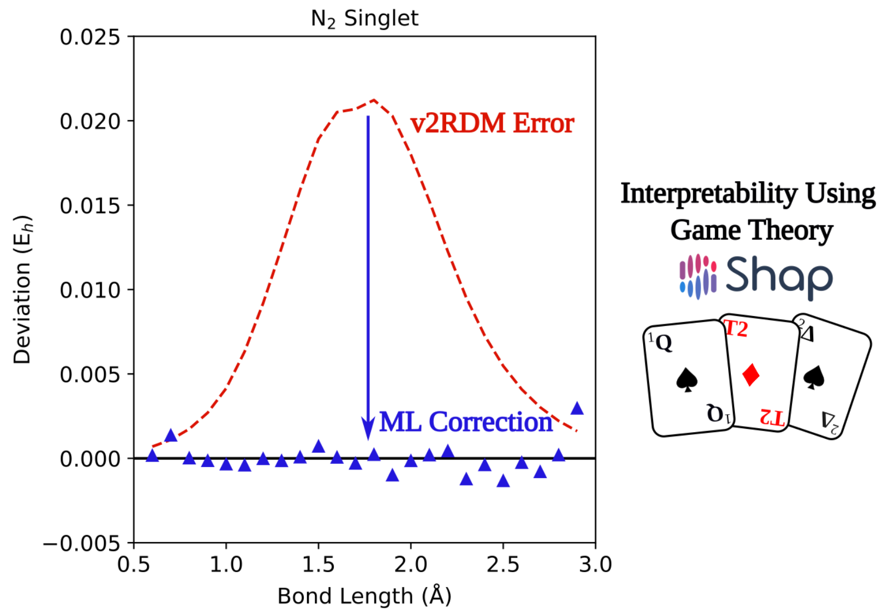

# Data-Driven Variational Two-Electron Reduced-Density-Matrix (DDv2RDM) 

A repository containing code examples from [Data-Driven Refinement of Electronic Energies from Two-Electron Reduced-Density-Matrix Theory](https://pubs.acs.org/doi/10.1021/acs.jpclett.3c01382)


### Files
- `singlet_doublet`: Directory containing neutral singlet and doublet diatomic molecules using the STO-3G, 6-31G, and cc-pVDZ basis sets
- `triplet_quartet`: Directory containing neutral triplet and quartet diatomic molecules using the STO-3G, 6-31G, and cc-pVDZ basis sets
- `example.ipynb`: Jupyter notebook with examples on how to run the machine learning model and subsequent SHapley Additive exPlanation (SHAP) analysis


### Citation:
```
@article{jones2023data,
  title={Data-Driven Refinement of Electronic Energies from Two-Electron Reduced-Density-Matrix Theory},
  author={Jones, Grier M and Li, Run R and DePrince III, A Eugene and Vogiatzis, Konstantinos D},
  journal={The Journal of Physical Chemistry Letters},
  volume={14},
  pages={6377--6385},
  year={2023},
  publisher={ACS Publications}
}
```

